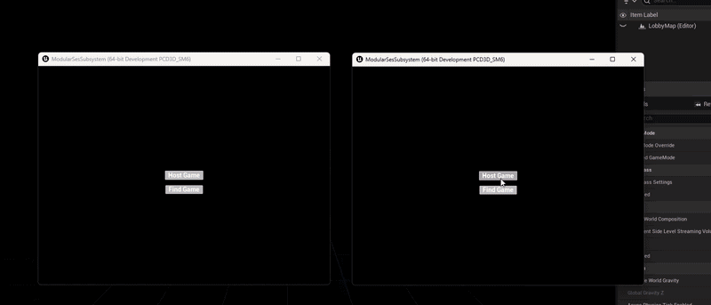

# Modular Multiplayer Sessions Subsystem (MSS)

[](https://www.unrealengine.com/)
[](#-tech-stack)
[](LICENSE)

A lightweight, decoupled, and production-ready **Unreal Engine 5** plugin that encapsulates the online session lifecycle in a `UGameInstanceSubsystem`.

Built around modern Unreal Engine architecture principles: it eliminates God-Object `GameInstance` bloat, provides zero-boilerplate Blueprint integration, cleans up asynchronous delegates to prevent leaks, and integrates with Project Settings through `UDeveloperSettings`.

---

## 🎮 Showcase



*Two independent standalone game instances discovering and connecting via LAN broadcast.*

---

## ✨ Key Features

- **Decoupled Architecture (`UGameInstanceSubsystem`):** The lifecycle is managed automatically across map loads. Drop it into any UE5 project without touching your own GameInstance.
- **Embedded Developer Settings (`UDeveloperSettings`):** Configure default player counts, search limits, and LAN flags in `Project Settings → Plugins → Modular Sessions`, with no manual `.ini` editing.
- **Event-Driven Asynchronous Callbacks:** Dynamic multicast delegates (`FMSSOn...Complete`) expose clean asynchronous execution pins to Blueprints and UMG.
- **Strict Delegate Cleanup:** Every async operation clears its delegate handle (`ClearOn...Delegate_Handle`) in its callback, preventing dangling bindings and leaks.
- **Auto Connect & Travel:** Resolves the platform connect string (`GetResolvedConnectString`) and calls `ClientTravel` automatically after a successful join.
- **Cross-Platform Ready:** Works with local loopback/LAN (`OnlineSubsystemNull`) and online platforms (Steam, EOS), with proper presence query guards.
- **Safe Session Re-creation:** If a host creates a new room without cleanly destroying the previous one, the existing session is torn down and recreated automatically.

---

## 🏛️ Architecture Overview

```text
       [ UI / Gameplay (UMG / Blueprints) ]
                        │
                        ▼  (Calls Create / Find / Join)
           [ UMSSSessionSubsystem ] ◄─── Reads defaults from [ UModularSessionsSettings ]
                        │
                        ▼  (Async wrappers & handle tracking)
              [ IOnlineSessionPtr ]
```

---

## 🚀 Quick Start & Installation

### 1. Installation

Clone the repository (or copy the plugin folder) into your project's `Plugins/` directory:

```bash
cd YourProject/Plugins
git clone https://github.com/menars98/ModularSesSubsystem.git
```

Then regenerate your project files and rebuild.

### 2. Configure Defaults

Go to **Project Settings → Plugins → Modular Sessions**:

| Setting | Description | Default |
|---|---|---|
| Default Max Num Players | Room capacity | `4` |
| Max Search Results | Search query limit | `100` |

---

## 💻 Blueprint Usage

### Hosting a Session

Call **Create Session** on the `MSSSessionSubsystem`. Once it completes successfully, travel the host to your lobby map with the `?listen` option:

```text
[Get MSSSessionSubsystem] ──► [Create Session]
                                    │
   [OnCreateSessionComplete] ◄──────┘
               │
               ▼ (Branch: Success)
 [Open Level (Lobby Map, Options: "listen")]
```

### Finding & Joining a Session

```text
[Get MSSSessionSubsystem] ──► [Find Sessions]
                                    │
     [OnFindSessionsComplete] ◄─────┘
               │
               ▼ (Branch: Success)
 [Session Results] ──► [Get Index 0] ──► [Join Session (MSS)]
                                                │
                                                ▼
                         (ClientTravel is executed automatically in C++)
```

---

## 🛠️ Tech Stack

- **Engine:** Unreal Engine 5.4+
- **Core Modules:** `OnlineSubsystem`, `OnlineSubsystemUtils`, `DeveloperSettings`
- **Build Tool:** UnrealBuildTool (UBT) / C++20

---

## 📄 License

This project is open-source and available under the [MIT License](LICENSE).

---

## 👨‍💻 Author

**Muhammet Enes Urlu**

- Portfolio: [m-enesportfolio.netlify.app](https://m-enesportfolio.netlify.app)
- LinkedIn: [Connect on LinkedIn](https://www.linkedin.com/in/enes-urlu-17b3371b4/)
- GitHub: [@menars98](https://github.com/menars98)
